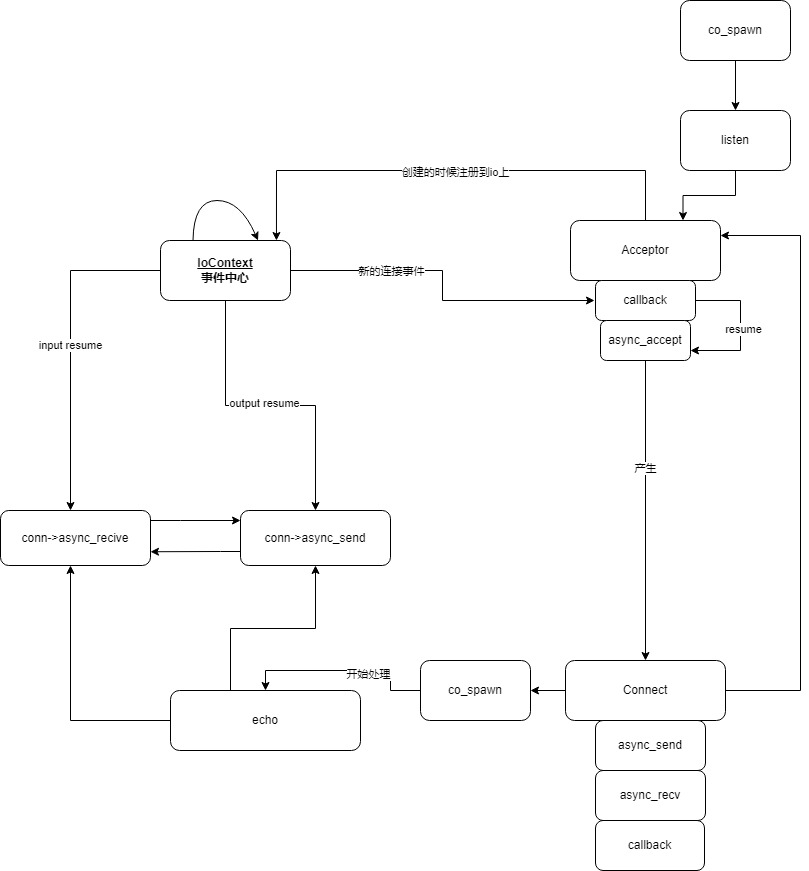

整个代码1300多行

分成以几个部分

- log,日志部分,用来表明整个代码运行的过程,具体看,这个提取出来的代码: <toGitLink file="./code_first/log.cpp" />
- io_context io事件的分发中心
- connect 抽象出来一次连接,异步的接收与发送
- AsyncSendAwaiter 异步的等待发送,直接io_context通知可以发送
- AsyncReceiveAwaiter 异步的等待接收,直接io_context通知可以接收
- Acceptor 一系列用于处理新连接的
- spawn 一个协程,目的是把一个task 变成不用再关心的协程,
  这个task是会无限的循环,处理指定的任务

1 第一部分
log

2 第二部分
name相关

- `set_name`
- `set_name_r`
- `NamedMixin`,继承自这个类,那么具体可以自身`m_h`取名字的能力

给每一个`std::coroutine_handle`取个名字


3 第三部分

task类的定义


神奇在是`promise_type`里有一个`std::coroutine_handle<> m_continue = nullptr`
的东西.当前的task执行完后,执行下一个?

这个`m_continue`是下面的代码里的`Awaiter`给它的

同时task本身是可以`co_await`的
先把自己挂起来


```cpp
task func1() {

}

task func2(){
  auto task1 = func1();
  co_await task1;
}
```

当另一个协程b内`co_await a`时,b会挂起,a的内部记录`m_continue = b 的corotine hanele`
`resume a`

让b挂起,a执行,返回执行b的caler
如果a执行结果到达了,`a.promise().final_suspend`
返回一个FinalAwaiter


测试代码见:

<toGitLink file="./code_first/task.cpp" />


## 3 第三部分 spawn

spawn从字面意思是创建一个不用再关心的协程

使用代码如下
```cpp
Spawn co_spawn (awaitable awaiter){
  co_await awaiter; //B
}

Task myfunc(){
  await do something;// A
}

Task func2(){
  co_spawn(myfunc()); //x
}
```
1. x处调用co_spawn
1. myfunc() 会挂起在`initial_suspend`
2. B处调用`myfunc().Awater::resume`
3. 执行到A处,myfunc,挂起,
4. myfunc 可能会被其它函数resume,
5. 可知,当`myfunc()`结束(`final_suspend`),`co_spawn`会被
   `m_continue`被resume,进而B处结束

`spawn`

```plaintext
initial_suspend  nerver
final_suspend  nerver
```

过了一段时间后,还是不懂`co_spawn`运行的原理,下面写一个完整的代码,对应`https://cpphub.roj.ac.cn/cpp20/corountines/`
来理解

- **为什么co_spawn可以**不在管函数的运行了
- `co_spawn`内的协程挂起来会返回哪里?
  普通函数F调用协程A,
  协程A调用协程B,那么B挂起后,返回到caller,
  那么这个caller是B,还F

在一个协程内调用另一个协程,
```plaintext
       co_spawn    coroutineA
      +------+    +------+
f --> |      |--> |      |
      |      |    |      |
      +------+    +------+
```

## 4 第四部分 IoContext and connection

- Callback的虚函数

核心在`run`,从epoll中取出事件,调用`evt.data.prt`对应的callback

- protocal
- Address::any()
- `endpoint->{adress,point}`
- setnonblocking

AsyncReceiveAwaiter: 核心,挂起来这后在`await_suspend`里做的事

AsyncSendAwaiter,核心同上

ConnImpl,连接的抽象

- 把socket加入到epoll中
- 方法`async_receive` 生成`AsyncReceiveAwaiter`
- 定义了一个callback,处理事件


## 5 第五部分 Acceptor

产生一个connection

使用


```
Task listen(IoContext &ctx, Name="listen") {

	Acceptor acceptor(ctx, Protocol::ip_v4(), Endpoint(Address::Any(), 8899));

	for (;;) {
		Connection conn = co_await acceptor.async_accept();
		co_spawn(echo(ctx, std::move(conn)), "spawn echo");
	}
}
```

- AcceptAwaiter
- AcceptorImpl
- Acceptor 对上面的简单包装


AcceptorImpl 构造的过程

1. open
  - `auto listenfd = ::socket(PF_INET, SOCK_STREAM, 0);`创建fd
  - `setnonblocking`
2. bind
  - `sockaddr_in serveraddr;`创建并填充数据
  - `auto binderr = ::bind(listenfd, (sockaddr *)&serveraddr, sizeof(serveraddr));`

3. listen
  - `int err = ::listen(listenfd, max_pendding_connection);`
  - `auto fd3 = epoll_ctl(m_ctx->handle(), EPOLL_CTL_ADD, listenfd, &evt);

## 6 TimerAwaiter 定时器相关

我没有看


## 1 Q AsyncReceiveAwaiter中的链表有会用?为什么

多次发送?

## 2 Q 怎么用图来描述这个模型?




每个`awaiter`的callback在哪里?
